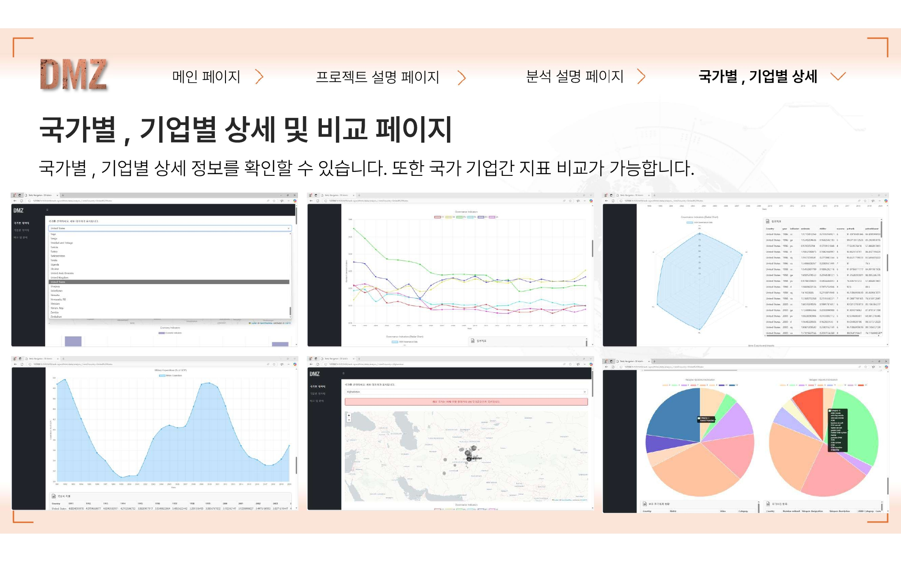

# DEFT — Defense Export Feasibility Tracker

An open-data analysis and interactive web platform that scores countries as defense-export targets from economic, governance, and conflict indicators (World Bank, WGI, UCDP, SIPRI; 1991-2020) — and statistically tests what actually predicts arms imports.

[](https://www.python.org/)
[](https://pandas.pydata.org/)
[](https://scikit-learn.org/)

## Results

- **Economic capacity is the only strong predictor of arms imports.** OLS regression (statsmodels, 125 countries in the training split, 5 predictors): economic score coefficient **+23,170 TIV per standard deviation, p < 0.001**. Governance score: p = 0.791 (no measurable effect). Conflict score: p = 0.093 (borderline). Model fit: **R² = 0.366** on the training set, **0.461** on the held-out 20% test set. Source: [docs/analysis-results.pdf](docs/analysis-results.pdf), regression output in [docs/Photo/photo_page-0009.jpg](docs/Photo/photo_page-0009.jpg).
- **170 countries scored and graded A/B/C** on three axes (economic / governance / conflict) using K-Means (k = 3, elbow-validated). Verified top of the ranking:

  | Rank | Country | Economic | Governance | Conflict | Average | Grade |
  | --- | --- | --- | --- | --- | --- | --- |
  | 1 | United States | 80.0 | 71.9 | 100.0 | **83.98** | A |
  | 2 | Germany | 71.7 | 75.2 | 100.0 | **82.30** | A |
  | 3 | Japan | 74.1 | 72.3 | 100.0 | **82.13** | A |
  | 4 | Canada | 67.1 | 77.3 | 100.0 | **81.46** | A |
  | 5 | Switzerland | 63.9 | 79.3 | 100.0 | **81.08** | A |

- **102,321 records across 13 committed JSON datasets** (`assets/data/`, ~54 MB, 1991-2020) integrated from World Bank, SIPRI, UCDP GED, and WGI — 210+ raw country-name variants standardized.
- **A fully static, no-backend web platform** to explore all of it: Leaflet world-map dashboard, DataTables data explorer, Chart.js analysis pages, and 196 per-country map pages.

**Demo video**: [YouTube walkthrough of the web platform](https://youtu.be/yfw2wbxgnqM)



## Quick Start

The site is static; the only requirement is Python (any 3.x) for a local file server.

```bash
git clone https://github.com/CY-HYUN/Global-Defense-Export-Analysis-Project.git
cd Global-Defense-Export-Analysis-Project
python -m http.server 8000
```

Then open <http://localhost:8000/index.html>. Verified entry points:

| Page | URL |
| --- | --- |
| Global map dashboard | `/index.html` |
| Data tables (9 datasets, search/sort/export) | `/html/about_project/layout-static_4.html` |
| Visualization charts | `/html/analysis/research_layout_2.html` |
| Country detail analysis | `/html/data/analysis_1.html` |
| Country comparison (up to 3 countries) | `/html/data/analysis_3.html` |

Notes:

- No build step and no pip installs — all processed data is committed as JSON in `assets/data/`.
- An internet connection is needed at runtime: CSS/JS libraries load from CDNs and the world GeoJSON for the map is fetched remotely.
- The defense-news feed is optional and off by default: it needs a free [NewsAPI](https://newsapi.org) key in `js/config.js` (the key field is intentionally empty in the repo).

## What is (and is not) in this repo

```text
index.html          Global dashboard (Leaflet map + news feed)
html/               Analysis, data-table, comparison, and 196 per-country map pages
js/, css/           Site logic (ES6 modules) and styles
assets/data/        13 processed JSON datasets — the ETL output (102,321 records)
scripts/            Python utilities used to generate/maintain the per-country pages
docs/               Final report (Korean, PDF/PPTX), analysis-results.pdf,
                    methodology slides (docs/Photo/), ERD diagrams
```

Honest notes for reviewers:

- The Jupyter notebooks used for preprocessing, scoring, and regression are **not** committed (in-class work). What is committed: their outputs (`assets/data/*.json`), the regression summary and methodology screenshots (`docs/Photo/`), and the full analysis report ([docs/analysis-results.pdf](docs/analysis-results.pdf)).
- The original course architecture diagram ([docs/Photo/photo_page-0001.jpg](docs/Photo/photo_page-0001.jpg)) proposed a DB-backed server layer (Oracle/Hadoop). The shipped implementation is a static site reading committed JSON — no database or backend is required or included.

## Architecture

```text
World Bank / SIPRI / UCDP GED / WGI  (CSV downloads, 1991-2020)
        │
        ▼
Python ETL + analysis  (pandas, scikit-learn, statsmodels — offline notebooks)
  country-name standardization → interpolation → scoring → clustering → OLS
        │
        ▼
13 processed JSON datasets  (assets/data/, ~54 MB)
        │
        ▼
Static web platform  (HTML/CSS/JS, Leaflet + Chart.js + DataTables)
```

## Methodology (summary)

Full detail with code excerpts: [docs/DETAILS.md](docs/DETAILS.md)

- **Cycloid time weighting** — each year's value is weighted by `w(t) = t - sin(t)` with the year normalized to `[0, 2π]`, so weights rise monotonically from 0.0 (1991) to 6.28 (2020) and recent years dominate the scores.
- **Economic score** — weighted average of 9 World Bank variables (GDP growth, income distribution, military share of GDP, trade balance, international capital, unemployment, FX reserves, public debt, CPI) → log transform → min-max scaled to 20-80.
- **Governance score** — mean percentile rank of the 6 WGI indicators (government effectiveness, regulatory quality, rule of law, voice and accountability, political stability, control of corruption).
- **Conflict score** — cycloid-weighted battle deaths (UCDP GED) → log transform → reverse min-max scale, so more deaths = lower score; countries with zero recorded conflict deaths score 100.
- **Grading** — K-Means (k = 3, chosen by elbow method) over the three scores → A/B/C export-target grades.
- **Prediction** — OLS of total weapon-import TIV (SIPRI) on the three scores plus cluster dummies, 80/20 train/test split with standardized features.

## Key findings

1. **Money, not politics, buys weapons.** The economic score is the only predictor significant at the 5% level (p < 0.001); the governance score shows no relationship with import volume (p = 0.791). Politically unstable but economically capable countries import heavily — target screening should weight purchasing power over political stability.
2. **Conflict is borderline** (p = 0.093): not significant at the 5% level, and its direction is not settled in the committed outputs.
3. **Most of the variance is elsewhere.** R² = 0.366 means ~63% of import variation is driven by factors outside these indicators — alliance structures, political decisions, technology-transfer/offset deals — which bounds how far indicator-only screening can go.
4. **South Korea's import mix** (from the committed SIPRI-derived records: 509 import entries, 1991-2020, mapped to US ITAR/USML categories): missiles (Cat. 4) 34.8%, aircraft (Cat. 8) 20.6%, military electronics (Cat. 11) 11.0% of entries.

## Verify the numbers yourself

The data-scale claims above are recomputable from the committed datasets — from the project root:

```python
import json, glob
from collections import Counter

files = glob.glob('assets/data/*.json')
total = sum(len(json.load(open(p, encoding='utf-8'))) for p in files)
print(f'{len(files)} datasets, {total} records')          # 13 datasets, 102321 records

scored = json.load(open('assets/data/Economy_data.json', encoding='utf-8'))
print(f'{len(scored)} countries in the scored set')        # 170

kr = [r for r in json.load(open('assets/data/weapon_import.json', encoding='utf-8'))
      if r['Country'] == 'South Korea']
top = Counter(r['USML Category'] for r in kr).most_common(3)
print(f'South Korea: {len(kr)} import records; top USML categories: {top}')
# 509 records; [('4', 177), ('8', 105), ('11', 56)] -> 34.8% / 20.6% / 11.0%
```

The regression numbers come from the committed statsmodels output ([docs/Photo/photo_page-0009.jpg](docs/Photo/photo_page-0009.jpg)) and the analysis report ([docs/analysis-results.pdf](docs/analysis-results.pdf)); the score table comes from [docs/Photo/photo_page-0007.jpg](docs/Photo/photo_page-0007.jpg).

## Tech stack

| Layer | Tools |
| --- | --- |
| Analysis (offline) | Python, pandas, NumPy, scikit-learn (KMeans, scalers), statsmodels (OLS) |
| Frontend | HTML5, CSS3, JavaScript (ES6 modules), Bootstrap 5.2.3 |
| Visualization | Chart.js 3.7.1, Leaflet 1.9.3, DataTables/simple-datatables |
| Data | 13 committed JSON datasets; optional NewsAPI feed |

## Data sources

- [SIPRI](https://www.sipri.org/databases) — arms transfers (TIV) and military expenditure
- [World Bank Open Data](https://data.worldbank.org/) — 9 economic indicators, 1991-2020
- [UCDP](https://ucdp.uu.se/) — georeferenced conflict events and battle deaths, 1989-2020
- [WGI](https://www.worldbank.org/en/publication/worldwide-governance-indicators) — 6 governance indicators, 1996-2020
- US ITAR/USML — 22 weapon-category taxonomy used for portfolio mapping

## Limitations

- Data ends in 2020; post-2022 shifts (Ukraine war) are not reflected.
- SIPRI TIV measures transfer volume, not contract value — unit prices are ignored.
- The scored set is 170 countries after standardization and filtering; raw source coverage varies widely per dataset, from 31 countries (R&D spending) to 230 (arms imports).
- Analysis notebooks are not in the repo; all numbers above are taken from the committed regression output, report, and datasets (record counts and the Korea category split are directly recomputable from `assets/data/`).

## Credits

Team capstone project — Hanwha Aerospace Smart Data Analysis Course, Team 2 ("Chunmoo-II"). Domestic company names in the clustering data are anonymized. Academic references and the full methodology are listed in [docs/DETAILS.md](docs/DETAILS.md).
